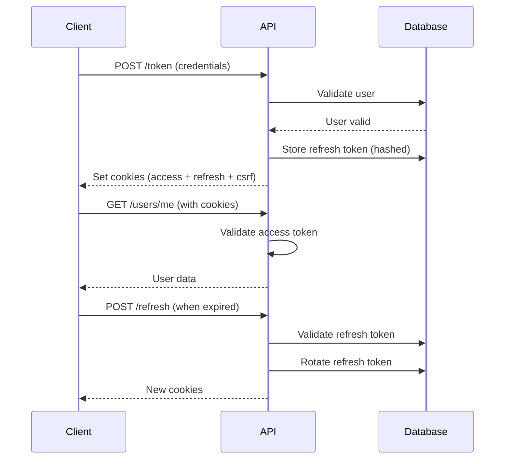

## Overview

ExpertEngine uses **cookie-based JWT authentication** with:

- **Access tokens** stored in HTTP-only cookies (15 min expiry)
- **Refresh tokens** stored in database with SHA256 hashing (7 day expiry)
- **CSRF protection** via double-submit cookie pattern
- **Token rotation** on every refresh

## Authentication Flow



## Endpoints

### Login

```http
POST /token
Content-Type: application/x-www-form-urlencoded

username=user@example.com&password=yourpassword
```

**Response Headers:**

```
Set-Cookie: access_token=eyJ...; HttpOnly; Secure; SameSite=Strict
Set-Cookie: refresh_token=abc...; HttpOnly; Secure; SameSite=Strict
Set-Cookie: csrf_token=xyz...; Secure; SameSite=Strict
```

**Response Body:**

```json
{
  "access_token": "eyJ...",
  "token_type": "bearer"
}
```

### Get CSRF Token

For state-changing requests, include the CSRF token:

```http
GET /csrf-token
```

```json
{
  "csrf_token": "xyz..."
}
```

### Refresh Token

```http
POST /refresh
X-CSRF-Token: xyz...
```

Returns new access and refresh tokens in cookies.

### Logout

```http
POST /logout
X-CSRF-Token: xyz...
```

Revokes all tokens and clears cookies.

## Using Authentication

### Browser (JavaScript)

Cookies are sent automatically:

```javascript
// Login
const response = await fetch("/token", {
  method: "POST",
  credentials: "include",
  headers: { "Content-Type": "application/x-www-form-urlencoded" },
  body: new URLSearchParams({
    username: "user@example.com",
    password: "password",
  }),
});

// Subsequent requests (cookies auto-included)
const user = await fetch("/users/me", {
  credentials: "include",
}).then((r) => r.json());

// State-changing request (include CSRF)
const csrfToken = document.cookie
  .split("; ")
  .find((row) => row.startsWith("csrf_token="))
  ?.split("=")[1];

await fetch("/tasks", {
  method: "POST",
  credentials: "include",
  headers: {
    "Content-Type": "application/json",
    "X-CSRF-Token": csrfToken,
  },
  body: JSON.stringify({ name: "New Task" }),
});
```

### Python

```python
import requests

session = requests.Session()

# Login
session.post('http://localhost:8030/token', data={
    'username': 'user@example.com',
    'password': 'password'
})

# Get CSRF token
csrf = session.get('http://localhost:8030/csrf-token').json()['csrf_token']

# Authenticated request
user = session.get('http://localhost:8030/users/me').json()

# State-changing request
session.post('http://localhost:8030/tasks',
    headers={'X-CSRF-Token': csrf},
    json={'name': 'New Task'}
)
```

### cURL

```bash
# Login and save cookies
curl -c cookies.txt -X POST http://localhost:8030/token \
  -d "username=user@example.com&password=password"

# Get CSRF token
CSRF=$(curl -b cookies.txt http://localhost:8030/csrf-token | jq -r '.csrf_token')

# Authenticated request
curl -b cookies.txt http://localhost:8030/users/me

# State-changing request
curl -b cookies.txt -X POST http://localhost:8030/tasks \
  -H "Content-Type: application/json" \
  -H "X-CSRF-Token: $CSRF" \
  -d '{"name": "New Task"}'
```

## Security Features

<AccordionGroup>
  <Accordion title="HTTP-Only Cookies">
    Cookies cannot be accessed by JavaScript, preventing XSS attacks.
  </Accordion>
  <Accordion title="CSRF Protection">
    All state-changing requests require a CSRF token header.
  </Accordion>
  <Accordion title="Token Rotation">
    Refresh tokens are rotated on each use, preventing replay attacks.
  </Accordion>
  <Accordion title="Secure Flags">
    Cookies use `Secure` and `SameSite=Strict` in production.
  </Accordion>
</AccordionGroup>

## Error Responses

| Code | Error                   | Description                       |
| ---- | ----------------------- | --------------------------------- |
| 401  | `invalid_credentials`   | Wrong email or password           |
| 401  | `token_expired`         | Access token expired, use refresh |
| 401  | `refresh_token_invalid` | Refresh token invalid or revoked  |
| 403  | `csrf_missing`          | CSRF token header missing         |
| 403  | `csrf_invalid`          | CSRF token doesn't match          |
