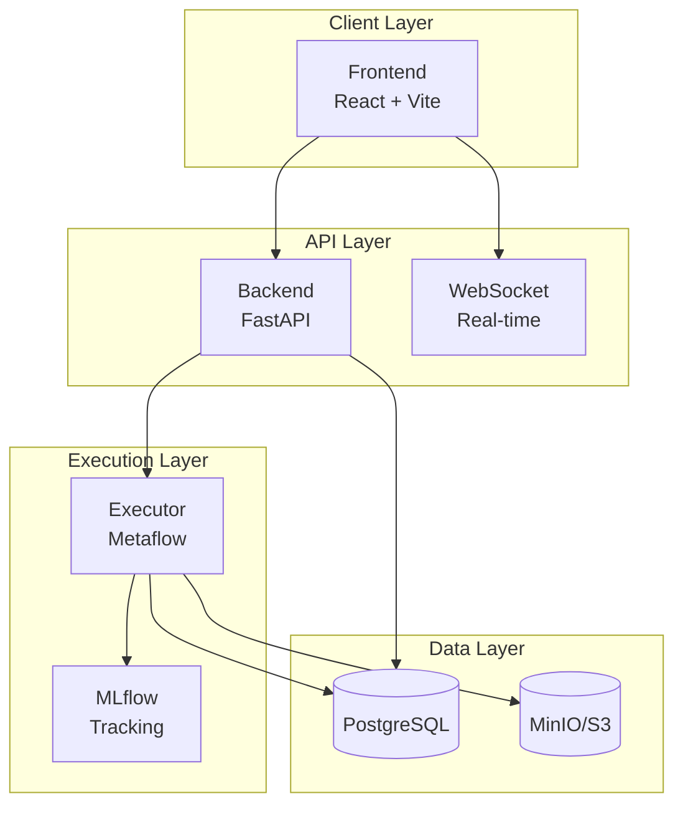
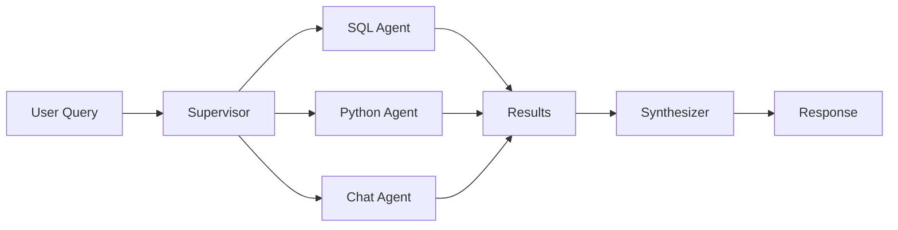

## System Overview

ExpertEngine is built as a **microservices architecture** with three main services:

## Components

<CardGroup cols={2}>
  <Card title="Frontend" icon="window">
    **Technology**: React + Vite + TailwindCSS Modern web application with: -
    Dashboard for managing resources - Genie AI chat interface - Interactive
    notebooks - Visual pipeline builder
  </Card>
  <Card title="Backend" icon="server">
    **Technology**: FastAPI + LangChain REST API server with: - Cookie-based JWT
    authentication - AI agents (SQL, Python, Chat) - WebSocket for real-time
    updates - OpenTelemetry observability
  </Card>
  <Card title="Executor" icon="microchip">
    **Technology**: Metaflow + Python Execution service for: - SQL query
    execution - Python code execution - Pipeline orchestration - ML model
    training
  </Card>
  <Card title="Infrastructure" icon="cloud">
    **Technology**: Terraform + Kubernetes Cloud deployment with: - AWS EKS,
    RDS, S3 - ArgoCD for GitOps - Prometheus + Grafana
  </Card>
</CardGroup>

## Data Flow

<Steps>
  <Step title="User Request">User creates a task or asks Genie a question</Step>
  <Step title="API Processing">
    Backend validates request, determines execution path
  </Step>
  <Step title="Agent Routing">
    For Genie requests, the Supervisor agent routes to specialists
  </Step>
  <Step title="Execution">
    Executor runs SQL/Python code in isolated environment
  </Step>
  <Step title="Artifact Storage">
    Results saved to MinIO/S3 as Parquet, CSV, or images
  </Step>
  <Step title="Response">Backend returns results to frontend in real-time</Step>
</Steps>

## AI Agent Architecture

Genie uses a **supervisor pattern** with specialized agents:

| Agent            | Purpose                              | Tools                                      |
| ---------------- | ------------------------------------ | ------------------------------------------ |
| **SQL Agent**    | Database queries, schema exploration | `execute_sql`, `get_schema`, `list_tables` |
| **Python Agent** | Data analysis, visualization         | `execute_python`, `create_chart`           |
| **Chat Agent**   | General questions, guidance          | `search_resources`, `explain_concept`      |
| **Synthesizer**  | Combine results into final answer    | —                                          |

## Technology Stack

<Tabs>
  <Tab title="Backend">
    | Technology | Purpose | |------------|---------| | **FastAPI** | REST API
    framework | | **LangChain** | LLM orchestration | | **LangGraph** | Agent
    workflows | | **SQLAlchemy** | Database ORM | | **Pydantic** | Data
    validation | | **OpenTelemetry** | Observability |
  </Tab>
  <Tab title="Frontend">
    | Technology | Purpose | |------------|---------| | **React 18** | UI
    framework | | **Vite** | Build tool | | **TailwindCSS** | Styling | |
    **Zustand** | State management | | **AG-Grid** | Data tables | | **React
    Query** | Data fetching |
  </Tab>
  <Tab title="Executor">
    | Technology | Purpose | |------------|---------| | **Metaflow** | Pipeline
    orchestration | | **MLflow** | Experiment tracking | | **Pandas** | Data
    processing | | **Matplotlib** | Visualization | | **SQLAlchemy** | Database
    access |
  </Tab>
  <Tab title="Infrastructure">
    | Technology | Purpose | |------------|---------| | **Terraform** |
    Infrastructure as Code | | **Kubernetes** | Container orchestration | |
    **Docker** | Containerization | | **ArgoCD** | GitOps deployment | | **AWS**
    | Cloud provider |
  </Tab>
</Tabs>

## Security Model

<Note>ExpertEngine implements defense-in-depth security:</Note>

- **Authentication**: JWT tokens in HTTP-only cookies
- **CSRF Protection**: Double-submit cookie pattern
- **Token Rotation**: Refresh tokens rotated on every use
- **Encryption**: AES-256 for stored credentials
- **Input Validation**: SQL injection & XSS prevention
- **Rate Limiting**: Per-user and global limits

See [Security Configuration](/deployment/security) for production hardening.

## Repositories

| Repository                                                                                  | Description                        |
| ------------------------------------------------------------------------------------------- | ---------------------------------- |
| [expertdata-backend](https://github.com/ExpertData-io/expertdata-backend)                   | API server, agents, business logic |
| [expertengine-frontend-react](https://github.com/ExpertData-io/expertengine-frontend-react) | Web application UI                 |
| [expertengine-executor](https://github.com/ExpertData-io/expertengine-executor)             | Execution service                  |
| [expertengine-infra](https://github.com/ExpertData-io/expertengine-infra)                   | Infrastructure as Code             |
| [docs](https://github.com/JorgeQuintanaL/docs)                                              | This documentation                 |
