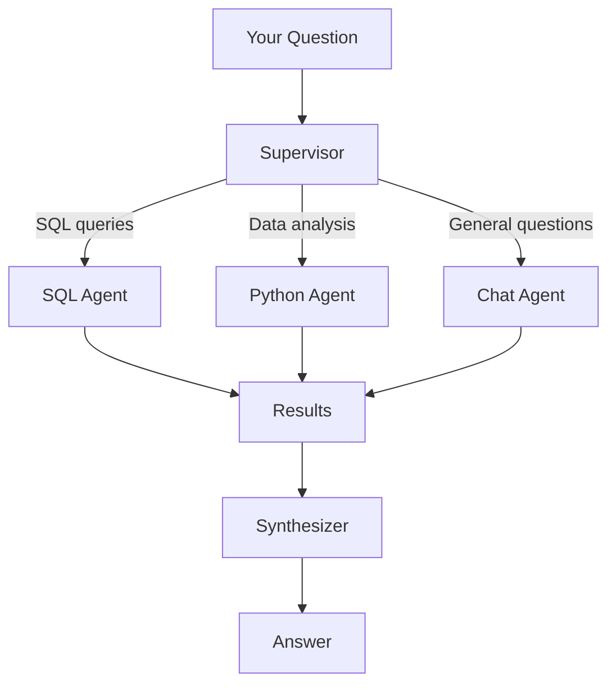

## What is Genie?

**Genie** is ExpertEngine's AI assistant. Ask questions in natural language, and Genie will generate SQL queries, analyze data, create visualizations, and manage your resources—all automatically.

<Note>
  Genie is powered by LangChain and supports multiple LLM providers (OpenAI,
  Anthropic, Google).
</Note>

## Capabilities

<CardGroup cols={2}>
  <Card title="SQL Generation" icon="database">
    Generate and execute SQL queries from natural language
  </Card>
  <Card title="Data Analysis" icon="chart-line">
    Analyze data with Python and create visualizations
  </Card>
  <Card title="Resource Management" icon="folder">
    Create connectors, tasks, and pipelines via chat
  </Card>
  <Card title="Explanations" icon="lightbulb">
    Get explanations of data, code, and results
  </Card>
</CardGroup>

## Using Genie

### Access Genie

Navigate to **Explorer** → **Genie** or click the Genie icon in the sidebar.

### Ask Questions

Simply type your question in natural language:

```
Show me the top 10 customers by revenue this month
```

Genie will:

1. Identify the relevant database and tables
2. Generate an optimized SQL query
3. Execute the query
4. Present results in a table or chart

### Example Queries

<Tabs>
  <Tab title="Data Exploration">
    ``` What tables are available in the production database? ``` ``` Show me
    the schema of the orders table ``` ``` How many records are in each table?
    ```
  </Tab>
  <Tab title="Analysis">
    ``` What's the average order value by customer segment? ``` ``` Show me
    revenue trends over the last 12 months ``` ``` Which products have declining
    sales? ```
  </Tab>
  <Tab title="Visualization">
    ``` Create a bar chart of sales by region ``` ``` Show me a line chart of
    daily active users ``` ``` Plot the distribution of order amounts ```
  </Tab>
  <Tab title="Resource Management">
    ``` Create a new PostgreSQL connector for the analytics database ``` ```
    Make a task that calculates daily revenue ``` ``` Build a pipeline that runs
    my ETL tasks every morning ```
  </Tab>
</Tabs>

## Agent Architecture

Genie uses a **supervisor pattern** with specialized agents:



### Agent Responsibilities

| Agent            | Handles                                 | Tools                            |
| ---------------- | --------------------------------------- | -------------------------------- |
| **SQL Agent**    | Database queries, schema exploration    | `execute_sql`, `get_schema`      |
| **Python Agent** | Data analysis, visualization, pandas    | `execute_python`, `create_chart` |
| **Chat Agent**   | General questions, guidance, resources  | `search_docs`, `list_resources`  |
| **Synthesizer**  | Combines results into a coherent answer | —                                |

## Conversation Context

Genie maintains conversation context, so you can ask follow-up questions:

```
You: Show me sales by region
Genie: [Shows table of sales by region]

You: Make that a pie chart
Genie: [Creates pie chart from the same data]

You: What's the year-over-year change?
Genie: [Calculates YoY change for each region]
```

## Artifacts

Genie saves results as artifacts that you can:

- **View** in the conversation
- **Download** as CSV, Parquet, or image
- **Use** in tasks and pipelines
- **Share** with team members

## Tips for Better Results

<AccordionGroup>
  <Accordion title="Be specific">
    Instead of "show me sales", try "show me monthly sales for the enterprise
    segment in 2024"
  </Accordion>
  <Accordion title="Specify the data source">
    If you have multiple connectors, mention which one: "query the production
    database"
  </Accordion>
  <Accordion title="Request visualizations explicitly">
    Say "create a bar chart" or "visualize as a line graph" for charts
  </Accordion>
  <Accordion title="Use follow-ups">
    Build on previous results: "now filter that to just Q4"
  </Accordion>
</AccordionGroup>

## Configuration

### LLM Providers

Genie supports multiple LLM providers. Configure in your environment:

```bash
# OpenAI (default)
OPENAI_API_KEY=sk-...

# Anthropic Claude
ANTHROPIC_API_KEY=sk-ant-...

# Google Gemini
GOOGLE_API_KEY=...
```

### Model Selection

You can configure the default model in settings:

| Provider  | Model             | Best For          |
| --------- | ----------------- | ----------------- |
| OpenAI    | gpt-4o            | General purpose   |
| Anthropic | claude-3.5-sonnet | Complex reasoning |
| Google    | gemini-pro        | Cost-effective    |

## API Reference

See [Genie API](/api/genie) for programmatic access to Genie.
