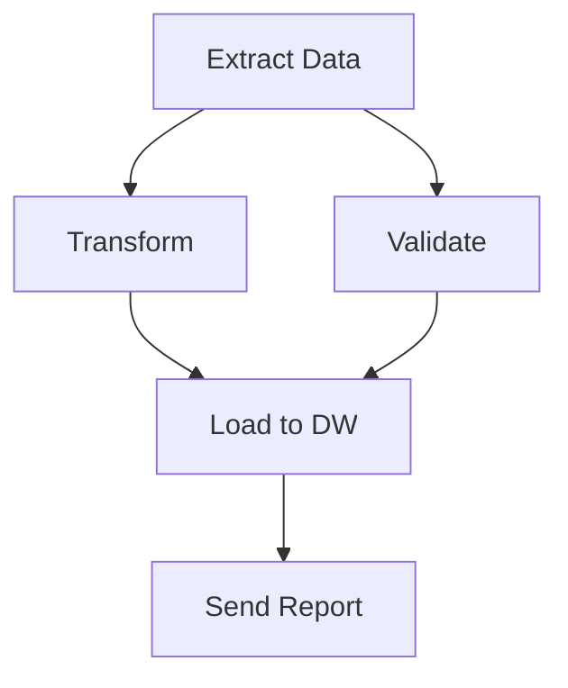

## What are Pipelines?

**Pipelines** orchestrate multiple tasks into end-to-end workflows. They handle task dependencies, error handling, and artifact passing automatically.

## Pipeline Features

<CardGroup cols={2}>
  <Card title="Task Chaining" icon="link">
    Connect tasks with data dependencies
  </Card>
  <Card title="Parallel Execution" icon="bolt">
    Run independent tasks simultaneously
  </Card>
  <Card title="Error Handling" icon="shield">
    Retry logic and failure notifications
  </Card>
  <Card title="Scheduling" icon="clock">
    Run on a cron schedule
  </Card>
</CardGroup>

## Creating a Pipeline

<Steps>
  <Step title="Navigate to Pipelines">Go to **Dashboard** → **Pipelines**</Step>
  <Step title="Click New Pipeline">Click the **+ New Pipeline** button</Step>
  <Step title="Add Tasks">Drag tasks from the sidebar to the canvas</Step>
  <Step title="Connect Tasks">Draw connections to define dependencies</Step>
  <Step title="Configure">
    Set retry policies, notifications, and scheduling
  </Step>
  <Step title="Save & Run">Save the pipeline and execute it</Step>
</Steps>

## Pipeline Structure



## Example Pipeline

```json
{
  "pipeline_name": "Daily ETL",
  "description": "Extract, transform, and load daily sales data",
  "tasks": [
    {
      "task_id": "extract",
      "task_uuid": "abc123",
      "depends_on": []
    },
    {
      "task_id": "transform",
      "task_uuid": "def456",
      "depends_on": ["extract"]
    },
    {
      "task_id": "validate",
      "task_uuid": "ghi789",
      "depends_on": ["extract"]
    },
    {
      "task_id": "load",
      "task_uuid": "jkl012",
      "depends_on": ["transform", "validate"]
    }
  ],
  "schedule": "0 6 * * *",
  "retry_policy": {
    "max_retries": 3,
    "delay_seconds": 60
  }
}
```

## Execution

When a pipeline runs:

<Steps>
  <Step title="Initialize">Metaflow creates a new run with unique ID</Step>
  <Step title="Execute Tasks">
    Tasks run in dependency order, with parallel where possible
  </Step>
  <Step title="Pass Artifacts">
    Output from each task is available to downstream tasks
  </Step>
  <Step title="Track Progress">Real-time status updates via WebSocket</Step>
  <Step title="Complete">Final status and artifacts stored in MinIO/S3</Step>
</Steps>

## Monitoring

View pipeline executions in the **Executions** tab:

| Column       | Description                 |
| ------------ | --------------------------- |
| **Run ID**   | Unique execution identifier |
| **Status**   | Running, Completed, Failed  |
| **Started**  | Execution start time        |
| **Duration** | Total execution time        |
| **Tasks**    | Task-level status breakdown |

## Scheduling

Pipelines can run on a schedule using cron syntax:

| Schedule         | Cron Expression |
| ---------------- | --------------- |
| Every hour       | `0 * * * *`     |
| Daily at 6 AM    | `0 6 * * *`     |
| Weekly on Monday | `0 0 * * 1`     |
| Monthly on 1st   | `0 0 1 * *`     |

## Error Handling

<AccordionGroup>
  <Accordion title="Retry Policy">
    Configure automatic retries for transient failures:
    ```json
    {
      "max_retries": 3,
      "delay_seconds": 60,
      "backoff_multiplier": 2
    }
    ```
  </Accordion>
  <Accordion title="Failure Notifications">
    Get alerted on pipeline failures via email or Slack
  </Accordion>
  <Accordion title="Partial Recovery">
    Resume from the last failed task instead of restarting
  </Accordion>
</AccordionGroup>

## API Reference

See [Pipelines API](/api/pipelines) for full endpoint documentation.
