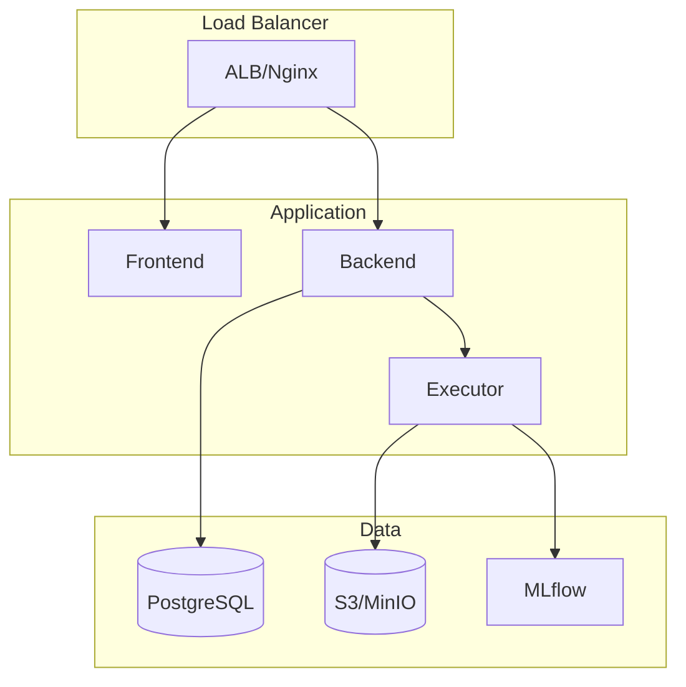

## Deployment Options

<CardGroup cols={2}>
  <Card title="Docker Compose" icon="docker" href="/deployment/docker">
    Simple deployment for small teams
  </Card>
  <Card title="Kubernetes" icon="dharmachakra" href="/deployment/kubernetes">
    Scalable deployment for production
  </Card>
  <Card title="AWS" icon="aws" href="/deployment/aws">
    Cloud-native on Amazon Web Services
  </Card>
</CardGroup>

## Architecture

## Production Checklist

<Steps>
  <Step title="Configure Environment">
    Set production environment variables
  </Step>
  <Step title="Set Up Database">Deploy PostgreSQL with backups</Step>
  <Step title="Configure Storage">Set up S3 or MinIO for artifacts</Step>
  <Step title="Enable HTTPS">Configure TLS certificates</Step>
  <Step title="Set Up Monitoring">Deploy Prometheus + Grafana</Step>
</Steps>

## Next Steps

Choose your deployment target and follow the guide:

- [Docker Compose](/deployment/docker) - For development and small teams
- [Kubernetes](/deployment/kubernetes) - For production at scale
- [AWS](/deployment/aws) - For cloud-native deployment
